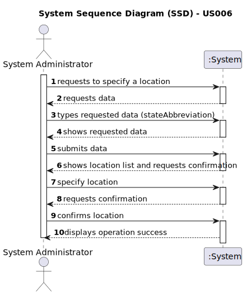

# US 006 - As a system administrator, I want to specify states, districts and cities in the system.

## 1. Requirements Engineering

### 1.1. User Story Description

As a system administrator, I want to specify states, districts and cities in the system.

### 1.2. Customer Specifications and Clarifications

**From the specifications document:**

> n/a

**From the client clarifications:**
> **Question**: As System Administrator, who wants to specify districts, municipalities and parishes, what specifically he wants to do? Create new locations? Control existent locations?
>
> **Answer**: The System Administrator wants to specify information in the system that can be used/selected to introduce the location.
 
> **Question**: Does the location of a store have to be detailed as well?
>
> **Answer**: An example of the store location is: 71 ST. NICHOLAS DRIVE, NORTH POLE, FAIRBANKS NORTH STAR, AK, 99705.
>
> In this address we have the:
> 
> Street: 71 ST. NICHOLAS DRIVE;
> City: NORTH POLE;
> District: Fairbanks North Star (this is opcional);
> State: AK;
> Zipcode: 99705.
> 
>In the USA, the addresses will not include municipalities or parishes.

> **Question**: Can there be more than one [system] admin?
> 
> **Answer**: No.

> **Question**: (...) "As a system administrator, I want to specify districts, municipalities, and parishes in the system." What is the purpose of this function, how does the system administrator intend to use the ability to specify different locations?
>
> **Answer**: (...) For instance, if the information about the existing US states is specified in the system, then the user only selects AK and does not need to write this information.

### 1.3. Acceptance Criteria

* **AC1:** One location has only one zipcode, one street name, one city name, one district name and one state name;
* **AC2:** One name can belong to more than one street, city or district;
* **AC3:**  All states have abreviated;

### 1.4. Found out Dependencies

* n/a

### 1.5 Input and Output Data

**Input Data:**

* Typed data:
  * stateAbbreviation
* Selected data:
  * location

**Output Data:**

* locationList
* (In)Success of the operation

### 1.6. System Sequence Diagram (SSD)

### 1.7 Other Relevant Remarks

* n/a