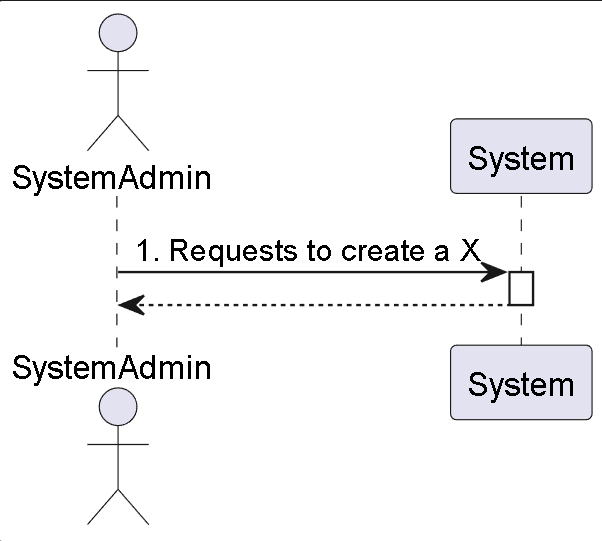
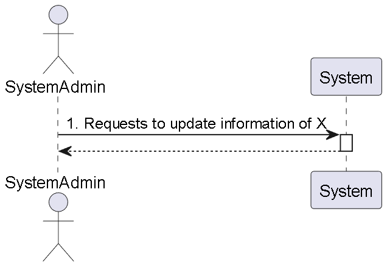
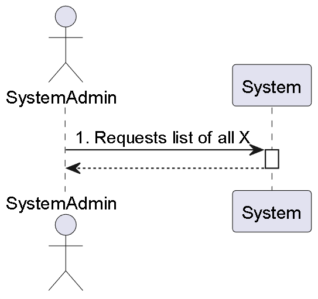

# Vista 1 de Processos

## - Create

**X** - Representa Building, Floor, Plant, Passage, Elevator, Room, RobotType and Robot.

## - Update

**X** - Represents Building, Floor, Passage, Elevator and Robot.

## - List

**X** - Represents Building, Floor, Passage, Elevator and Robot.

