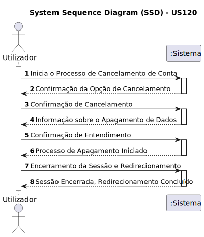

# US 120 - Como utente do sistema pretendo cancelar a minha conta garantindo que os meus dados são apagados
## Gestão de Contas de Utilizadores

## 1. Requirements Engineering

### 1.1. User Story Description

Como utente do sistema, pretendo cancelar a minha conta, garantindo que os meus dados são apagados.

### 1.2. Acceptance Criteria

* **AC1:** Ao cancelar a conta, o utente deve receber uma confirmação da operação.
* **AC2:** Após o cancelamento da conta, todos os dados pessoais associados ao utente devem ser permanentemente apagados.

### 1.3. Found Dependencies
* Dependência para com a US20(Registrar como Utente do Sistema) e US80(aprovar ou recusar o registo de um utente)

### 1.4. System Sequence Diagram (SSD)

### 1.5 Other Relevant Remarks
* Poderá ser proposta uma metodologia para em caso de reposição de um backup validar os pedidos de apagamento que surgiram entretanto.