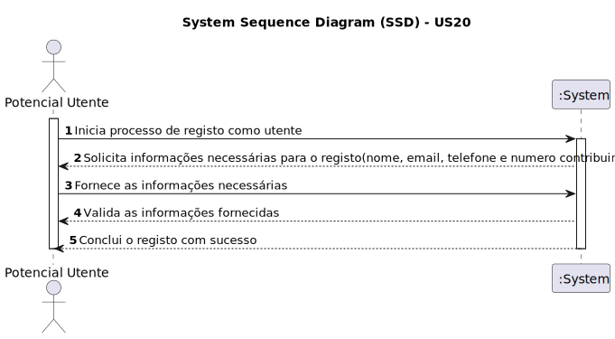

# US 20 - Como potencial utente do sistema (ex., aluno, docente) pretendo registar-me como utente do sistema
## Gestão de Tarefas

## 1. Requirements Engineering

### 1.1. User Story Description

Como potencial utente do sistema (ex., aluno, docente) pretendo registar-me como utente do sistema

### 1.2. Acceptance Criteria

* **AC1:** É possível iniciar o processo de registo como utente
* **AC2:** Será necessário obter nome, email,telefone e número de contribuinte para faturação de serviços (Fórum)
* **AC3:** Após fornecer as informações, o sistema valida e conclui o registo com sucesso

### 1.3. Found out Dependencies
* US30,40,50,60,70. Uma vez que é necessário o conhecimento dessas US's antes do registo

### 1.4. System Sequence Diagram (SSD)

### 1.5 Other Relevant Remarks
* Apenas serão aceites emails da organização, ex., isep.ipp.pt.
* Os utilizadores que utilizem a funcionalidade de registo serão sempre do tipo "utente"