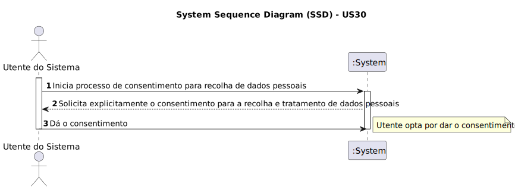

# US 30 - Dar o meu consentimento ou não à recolha e tratamento dos meus dados pessoais;

## 1. Requirements Engineering

### 1.1. User Story Description

Como utente do sistema, pretendo dar o meu consentimento à recolha e tratamento dos meus dados pessoais

### 1.2. Acceptance Criteria

* **AC1:** Se os consentimentos não forem dados, não será posisvel continuar o registo e deve ser apresentada uma mensagem ao utilizador
* **AC2:** Após o utente dar o consentimento, o sistema armazena e trata os dados pessoais de acordo com as políticas de privacidade

### 1.3. Found out Dependenciesr

### 1.4. System Sequence Diagram (SSD)

### 1.5 Other Relevant Remarks