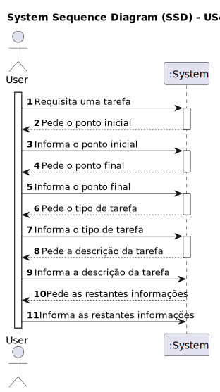

# US 460- Como utente do sistema pretendo requisitar uma tarefa indicando os parâmetros necessários à sua execução, nomeadamente o ponto inicial e o término e qual a tarefa pretendida
## Visualização 3D

## 1. Requirements Engineering

### 1.1. User Story Description

Como utente do sistema pretendo requisitar uma tarefa indicando os parâmetros necessários à sua execução, nomeadamente o ponto inicial e o término e qual a tarefa pretendida

### 1.2. Acceptance Criteria

* **AC1:** Obrigatória a escolha do ponto inicial, término e tarefa pretendida
* **AC2:** Deve guardar a informação do requerente
* **AC3:** Na requisição de uma tarefa será necessário indicar um contacto de "pickup" e um contacto de "delivery" (nome e número de telefone)
* **AC4:** As tarefas de vigilância caracterizam-se por indicar qual o edificio e piso(s) que se pretende vigiar bem como o número de contacto em caso de incidente. tipicamente o segurança irá requisitar que um robot "dê uma volta pelos pisos X, Y e Z do edificio N". Caso o robot detete alguma situação anómala, o robot irá enviar um SMS para o contacto indicado (*)
* **AC5:** As tarefas de "piclup & delivery" caracterizam-se por indicar qual a sala que se pretende de pickup e qual a sala de delivery, bem como um nome e um contacto para pickup e outro para delivery. deve também ser indicado um código de confirmação que a pessoa que receberá deverá introduzir no painel do robot. adicionalmente deve ser indicada uma descrição da entrega, ex., "Marcadores de cor vermelha (1x) e azul (2x)"

### 1.3. Found out Dependencies
* Dependência para com as Us's ligadas à criação de tarefas e robots

### 1.4. System Sequence Diagram (SSD)

### 1.5 Other Relevant Remarks