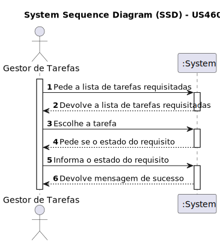

# US 470- Como gestor de tarefas pretendo aprovar ou recusar uma requisição
## Gestão de Tarefas

## 1. Requirements Engineering

### 1.1. User Story Description

Como gestor de tarefas pretendo aprovar ou recusar uma requisição

### 1.2. Acceptance Criteria

* **AC1:** As tarefas podem ser ou aprovadas ou rejeitadas

### 1.3. Found out Dependencies
* Dependência para com a US 460 (Requisitar uma tarefa)
* Dependência para com a US 480 (Consultar requisições não aprovadas)

### 1.4. System Sequence Diagram (SSD)

### 1.5 Other Relevant Remarks