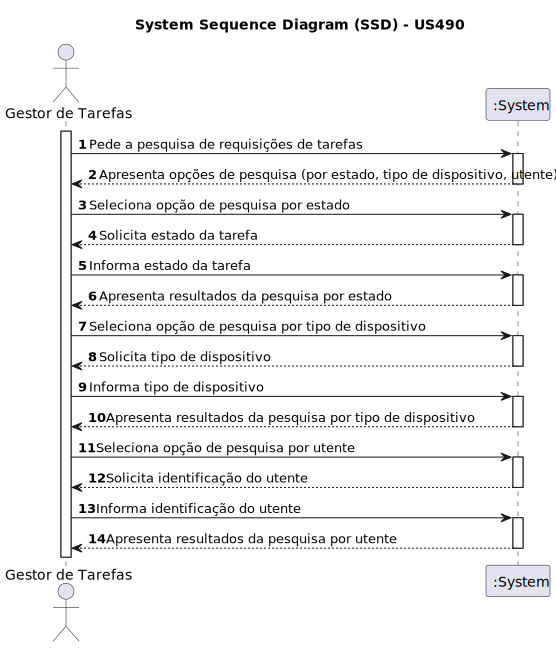

# US 490- Como gestor de tarefas, pretendo pesquisar as requisições de tarefas por estado, por tipo de dispositivo ou utente
## Gestão de Tarefas

## 1. Requirements Engineering

### 1.1. User Story Description

Como gestor de tarefas, pretendo pesquisar as requisições de tarefas por estado, por tipo de dispositivo ou utente.

### 1.2. Acceptance Criteria

* **AC1:** Possível realizar uma pesquisa de requisições de tarefas por estado.
* **AC2:** Possível realizar uma pesquisa de requisições de tarefas por tipo de robot
* **AC3:** Possível realizar uma pesquisa de requisições de tarefas por utente.
### 1.3. Found out Dependencies
* Dependência para com as US 460 (Requisitar uma tarefa)
* Dependência para com a US 470 (Aprovar ou recusar uma requisição)
* Dependência para com a US 480 (Consultar requisições não aprovadas)

### 1.4. System Sequence Diagram (SSD)

### 1.5 Other Relevant Remarks