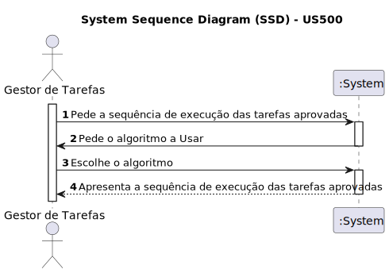

# US 500 - Como gestor de tarefas, pretendo obter a sequência de execução das tarefas aprovadas
## Gestão de Tarefas

## 1. Requirements Engineering

### 1.1. User Story Description

Como gestor de tarefas, pretendo obter a sequência de execução das tarefas aprovadas.

### 1.2. Acceptance Criteria

* **AC1:** É possível obter a sequência de execução das tarefas aprovadas.
* **AC2:** É necessário escolher o algoritmo

### 1.3. Found out Dependencies
* Dependência para com as US 460 (Requisitar uma tarefa)
* Dependência para com a US 470 (Aprovar ou recusar uma requisição)
* Dependência para com a US 480 (Consultar requisições não aprovadas)
* Interligação com requisito 1410/1430. deve permitir escolher qual o algoritimo a utilizar

### 1.4. System Sequence Diagram (SSD)

### 1.5 Other Relevant Remarks
* A obtenção da sequência de execução deve considerar as tarefas que foram previamente aprovadas.