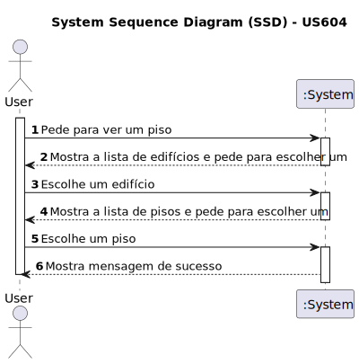

# US 604- Criar uma interface com o utilizador (GUI) que permita seleccionar o edifício e o piso que se pretende ver em cada momento.
## Visualização 3D

## 1. Requirements Engineering

### 1.1. User Story Description

Criar uma interface com o utilizador (GUI) que permita seleccionar o edifício e o piso que se pretende ver em cada momento.

### 1.2. Acceptance Criteria

* **AC1:** Seleção de edificio e piso dentro da visualização 3D.
* **AC2:** Seleção a qualquer momento.

### 1.3. Found out Dependencies

* Dependência para com as Us's ligadas à criação de edifícios e pisos.

### 1.6. System Sequence Diagram (SSD)

### 1.7 Other Relevant Remarks

* Deve ser visivel a qualquer momento da execução da visualização 3D.