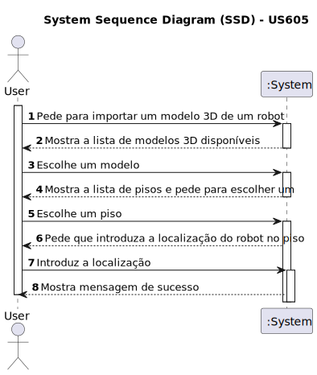

# US 605 - Importar o modelo 3D de um robot e permitir a sua visualização numa dada localização do piso seleccionado.

## 1. Requirements Engineering

### 1.1. User Story Description

Importar o modelo 3D de um robot e permitir a sua visualização numa dada localização do piso seleccionado.

### 1.2. Acceptance Criteria

* **AC1:** Seleção de um modelo 3D de robot a qualquer momento.
* **AC2:** Seleção de edificio e piso dentro da visualização 3D.
* **AC3:** Seleção da posição no piso.
* **AC4:** Seleção a qualquer momento.

### 1.3. Found out Dependencies

* Dependência para com as US's ligadas à criação de edifícios e pisos.
* Dependência para com as US's ligadas à manipulação da personagem do ambiente 3D.

### 1.6. System Sequence Diagram (SSD)

### 1.7 Other Relevant Remarks
