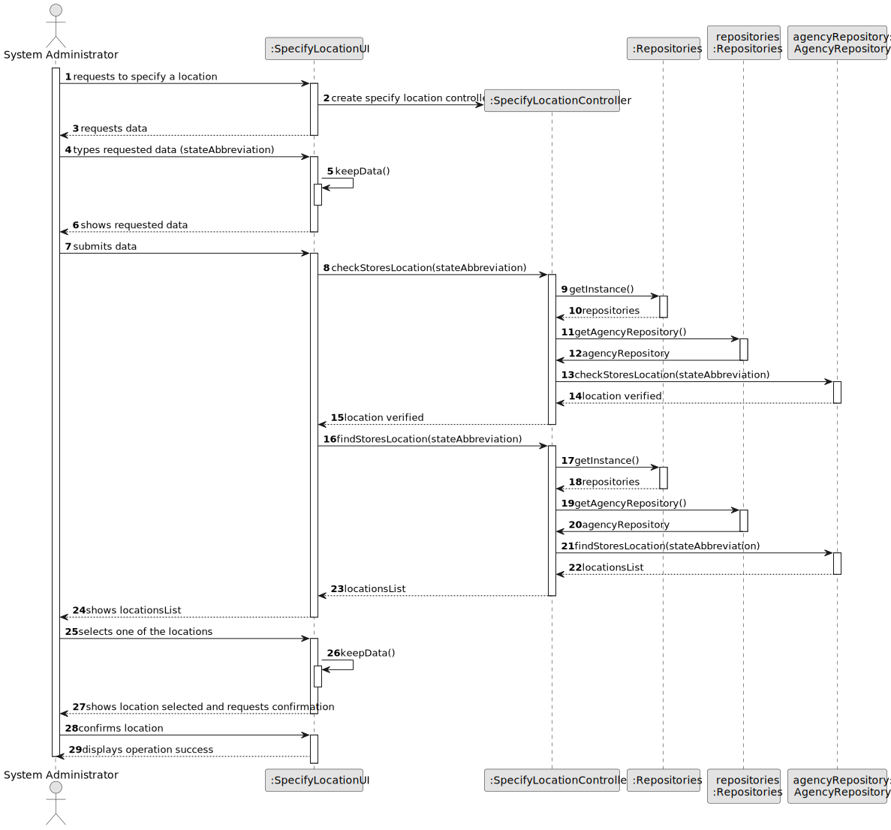
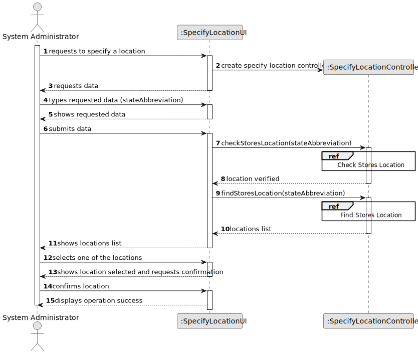
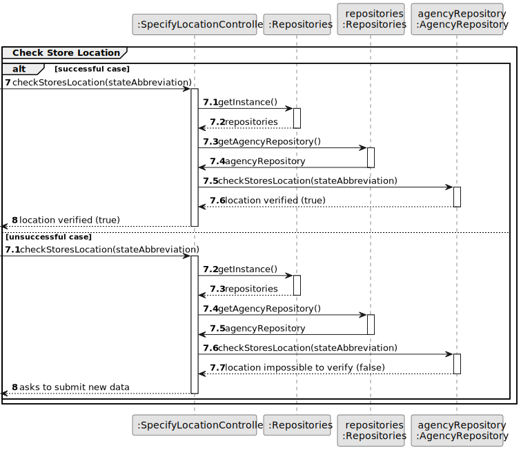
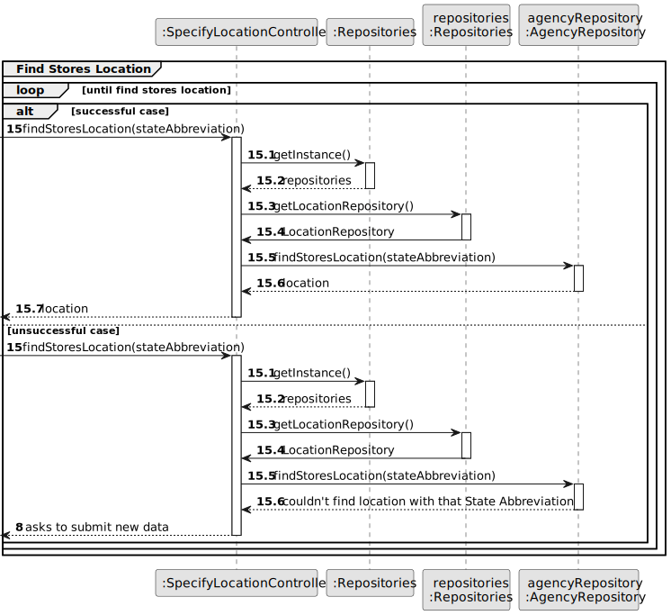
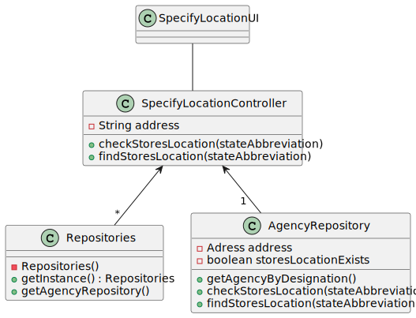

# US 006 - To create a Task 

## 3. Design - User Story Realization 

### 3.1. Rationale

**SSD - Alternative 1 is adopted.**

| Interaction ID                                        | Question: Which class is responsible for...  | Answer                    | Justification (with patterns)                                                                                 |
|:------------------------------------------------------|:---------------------------------------------|:--------------------------|:--------------------------------------------------------------------------------------------------------------|
| Step 1 : requests to register in the system		         | 	... interacting with the actor?             | SystemRegisterUI          | Pure Fabrication: there is no reason to assign this responsibility to any existing class in the Domain Model. |
| 			  		                                               | 	... coordinating the US?                    | SystemRegisterController  | Controller                                                                                                    |                                                      |
| 			  		                                               | ... knowing the user using the system?       | CurrentSession            | IE: cf. A&A component documentation.                                                                          |
| Step 2 : requests data  		                            | 				...request data?			                      | SystemRegisterUI          | Pure Fabrication                                                                                              |
| Step 3 : types requested data 		                      | 	...verifying data?                          | ClientRepository          | IE: object created in step 1 has its own data.                                                                |
| Step 4 : shows data and requests confirmation 		      | 	...knowing the data to show?                | System                    | IE: Task Categories are defined by the Administrators.                                                        |
| Step 5 : confirms data  		                            | 	... saving the submited data?               | SpecifyLocationController | IE: object created in step 1 is classified in one Category.                                                   |
| Step 6 : shows location and requests confirmation  		 | 							                                      |                           |                                                                                                               |              
| Step 7 : display operation success	                   | 	... validating all data (local validation)? | LocationRepository        | IE: owns its data.                                                                                            | 

### Systematization ##

According to the taken rationale, the conceptual classes promoted to software classes are: 

 * Organization
 * LocationRepository

Other software classes (i.e. Pure Fabrication) identified: 

 * SpecifyLocationUI  
 * SpecifyLocationController

## 3.2. Sequence Diagram (SD)

### Alternative 1 - Full Diagram

This diagram shows the full sequence of interactions between the classes involved in the realization of this user story.

### Alternative 2 - Split Diagram

This diagram shows the same sequence of interactions between the classes involved in the realization of this user story, but it is split in partial diagrams to better illustrate the interactions between the classes.

It uses interaction ocurrence.

**Check Store Location Partial SD**

**Find Store Location Partial SD**

## 3.3. Class Diagram (CD)

