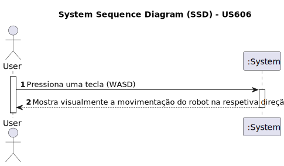

# US 606- Permitir a navegação interactiva (com o recurso ao teclado) do robot pelos diversos pisos dos diversos edifícios do campus.
## Visualização 3D

## 1. Requirements Engineering

### 1.1. User Story Description

Permitir a navegação interactiva (com o recurso ao teclado) do robot pelos diversos pisos dos diversos edifícios do campus.

### 1.2. Acceptance Criteria

* **AC1:** Uso do teclado para navegação do robot
* **AC2:** Colisões e respetivas animações

### 1.3. Found out Dependencies
* Dependência para com a US 605 (selecionar o robot e visualizar)

### 1.4. System Sequence Diagram (SSD)

### 1.5 Other Relevant Remarks