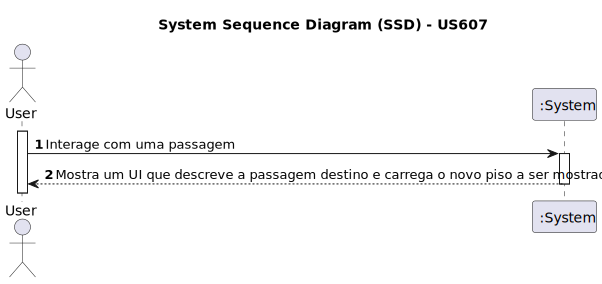

# US 607 - Ao navegar interativamente e ao chegar a uma passagem entre edifícios, o sistema deve transitar automaticamente para o piso adjacente.

## 1. Requirements Engineering

### 1.1. User Story Description

Ao navegar interativamente e ao chegar a uma passagem entre edifícios, o sistema deve transitar automaticamente para o piso adjacente.

### 1.2. Acceptance Criteria

- **AC1:** Navegação contínua entre edifícios
- **AC2:** Transição automática para o piso adjacente ao chegar à passagem entre edifícios

### 1.3. Found out Dependencies

- Dependência em relação à capacidade de detecção de passagens entre edifícios 

### 1.4. System Sequence Diagram (SSD)

### 1.5 Other Relevant Remarks

- Necessidade de coordenar a detecção de passagens entre edifícios com o mapeamento dos diferentes pisos para uma transição fluida e sem interrupções.